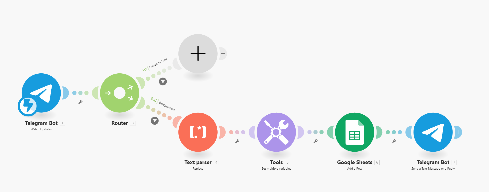
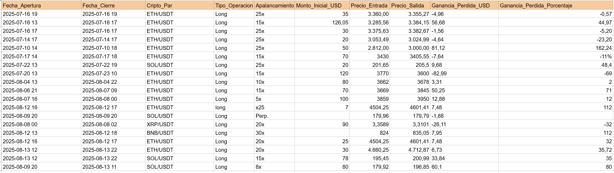

# 🚀 Crypto Trading Journal Bot (Telegram + Make + Google Sheets)

> **Status:** Active
> **Stack:** Make.com (Integromat), Telegram Bot API, Google Sheets
> **Use Case:** Automated Crypto Leverage Trading Logger

## 📖 Overview

This project automates the process of logging cryptocurrency leverage trades. Instead of manually opening a spreadsheet after every trade, you simply send a pre-formatted message to a private **Telegram Bot**. The bot parses the trade data, logs it into a database (**Google Sheets**), and replies with a confirmation summary.

This tool is designed to help traders maintain a disciplined trading journal with minimal friction.

---

## ⚙️ How it Works

The automation logic is hosted on **Make.com** and follows this flow:



1.  **Trigger (Telegram):** The bot watches for new messages.
2.  **Router:**
    * **Path 1 (Commands):** Handles system commands (e.g., `/start`).
    * **Path 2 (Operation Data):** The main logic path. It filters messages to ensure they contain trade data.
3.  **Text Parser & Tools:** The raw text message is parsed to extract key values (Entry Price, PnL, Pair, etc.).
4.  **Google Sheets:** A new row is added to the "Trading Journal" spreadsheet with the parsed data.
5.  **Response:** The bot sends a stylized confirmation message back to the user on Telegram.

---

## 📊 Database Structure (Google Sheets)

The bot expects a Google Sheet with specific columns to map the data correctly.



| Column | Header Name | Description |
| :--- | :--- | :--- |
| **A** | `Fecha_Apertura` | Date/Time trade opened |
| **B** | `Fecha_Cierre` | Date/Time trade closed |
| **C** | `Cripto_Par` | Asset Pair (e.g., ETH/USDT) |
| **D** | `Tipo_Operacion` | Side (Long/Short) |
| **E** | `Apalancamiento` | Leverage (e.g., 25x) |
| **F** | `Monto_Inicial_USD` | Margin used ($) |
| **G** | `Precio_Entrada` | Entry Price |
| **H** | `Precio_Salida` | Exit Price |
| **I** | `Ganancia_Perdida_USD` | Net PnL ($) |
| **J** | `Ganancia_Perdida_Porcentaje` | ROI (%) |

---

## 📱 Usage & Input Format

To log a trade, send a message to the bot using the following key-value structure.

> **Tip:** I recommend saving this format in your notes or clipboard for quick access.

### Input Format (Copy/Paste):
```text
Fecha_Apertura: YYYY-MM-DD HH:MM:SS
Fecha_Cierre: YYYY-MM-DD HH:MM:SS
Cripto_Par: COIN/USDT
Tipo_Operacion: Long/Short
Apalancamiento: 10x
Monto_Inicial_USD: 100
Precio_Entrada: 0000.00
Precio_Salida: 0000.00
Ganancia_Perdida_USD: 00.00
Ganancia_Perdida_Porcentaje: 00
